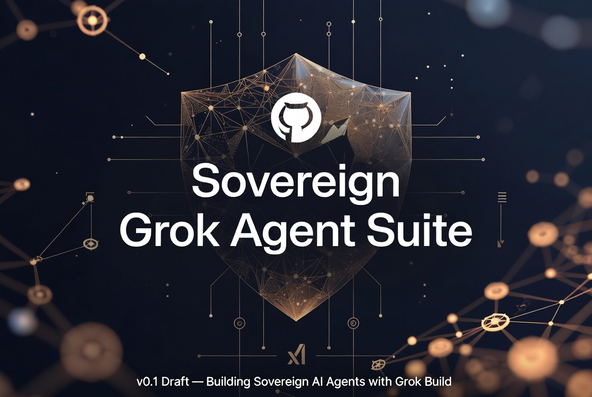

# Sovereign Grok Agent Suite



**v1.0.0**

Canonical hub: [github.com/MoloBTC-Org/sgas](https://github.com/MoloBTC-Org/sgas)

A modular collection of documents for building **sovereign, secure, and practical AI agent systems** with Grok Build.

---

## Current Status

- **Version**: v1.0.0
- This repository is the **canonical published suite**.
- **Grok Build** reached **v1.0.0** and is **open-sourced** (Apache 2.0) by xAI / SpaceXAI.
- Grok 4.5 is available on the free tier, which improves accessibility for Entry Tier users.
- Core documents include explicit privacy and sovereignty guidance on advanced cloud features (repository uploads).
- Adjacent infrastructure context (Start9 Personal Data Centers + Buzz / MeshLLM) is documented separately.

---

## Authorship and publication

**Author**: Jacques Strydom, PMP — **@JabulaniJakes**  
**Collaboration**: Grok (built by xAI / SpaceXAI)

**Publisher / housing**: [MoloBTC-Org](https://github.com/MoloBTC-Org) hosts this repository for distribution only. MoloBTC-Org does **not** take authorship credit.

**License**: [BSOL v1.0](https://github.com/MoloBTC-Org/bsol) — see [`LICENSE.md`](LICENSE.md)

---

## Repository Structure

```
sgas/
├── README.md
├── LICENSE.md                       # BSOL v1.0 (from MoloBTC-Org/bsol)
├── LICENSE                          # pointer
├── NOTICE
├── DONATIONS.md
├── CHANGELOG.md
├── CONTRIBUTING.md
├── Makefile
├── .gitignore
├── assets/
│   └── header-sovereign-grok-agent-suite.jpg
├── archive/
│   ├── Grok_Build_Ecosystem_Comprehensive_Synthesis.md
│   └── Grok_Build_vs_gstack_Comparative_Synthesis.md
└── docs/
    ├── Grok_Build_Sovereign_Foundations_Beginner_Guide.md
    ├── Grok_Build_Max_Security_Agent_Guide.md
    ├── Grok_Build_Advanced_Production_MCP_Zero_Trust.md
    ├── Sovereign_Local_Models_Guide_Starter_to_Advanced.md
    ├── Grok_Native_Sovereign_Agent_Path.md
    ├── Grok_Build_Capabilities_Reference_Card.md
    ├── Sovereign_Grok_Agent_Quick_Start_One_Pager.md
    ├── Visual_Journey_Map_Sovereign_Grok_Agent_Suite.md
    ├── Master_Index_Sovereign_Grok_Agent_Suite.md
    └── Sovereign_Agent_Infrastructure_Layer.md
```

---

## Quick Start

1. **[Quick Start One-Pager](docs/Sovereign_Grok_Agent_Quick_Start_One_Pager.md)** — Entry / Balanced / Top paths
2. **[Capabilities Reference Card](docs/Grok_Build_Capabilities_Reference_Card.md)** — what Grok Build can do
3. **[Master Index](docs/Master_Index_Sovereign_Grok_Agent_Suite.md)** — full navigation

**Reading path**: Beginner Foundations → Max Security Agent Guide → Advanced MCP Zero Trust → Local Models Guide → Grok-Native Path.

---

## Key Principles

- **Sovereignty & Local-First** where practical
- **Strategic Grok leverage** (free tier + paid tiers as optional accelerators)
- **Hardware-aware tiers** (Entry / Balanced / Top), including constrained and emerging-market setups
- **Security by design** (Zero Trust MCPs, worktrees, Plan Mode, strict permissions)
- **Honest trade-offs** (advanced agentic features may upload repository context — treat as high-privilege)
- **Open & inspectable** (Grok Build harness is Apache 2.0)

---

## Credits

Authored by **@JabulaniJakes** in collaboration with **Grok (built by xAI / SpaceXAI)**.

Published under **MoloBTC-Org** as a housing and distribution surface only.

---

## License

**BSOL v1.0** — Bitcoin Sovereign Open Source License  
Canonical license text: [MoloBTC-Org/bsol](https://github.com/MoloBTC-Org/bsol)  
This repo copy: [`LICENSE.md`](LICENSE.md)  
