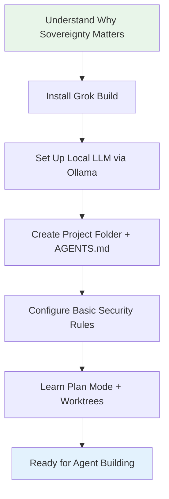

# Sovereign Grok Agent Suite — v1.0.0

# 01 — Foundations of Sovereign AI Agents
## Why and How to Build Your Grok Stack Securely from the Ground Up
**A Beginner’s Entry-Level Guide**  
**Version**: v1.0.0

Read this first. Then use the Max Security Agent Guide to build a real agent.

It focuses on **sovereignty and data security** as the foundation — explaining *why* these matter and how to set up a secure base with Grok Build before diving into agent construction.

---

## 1. Why Sovereignty and Data Security Matter in AI Agents

When you use AI (chatbots, agents, tools), you are giving it access to your thoughts, work, files, plans, research, and sometimes sensitive data. 

**The default (non-sovereign) way** most people use AI today:
- Everything goes to big company servers (OpenAI, Anthropic, Google, etc.).
- Your prompts, files, and outputs are processed on their machines.
- Tools and “agents” often use connectors (like MCP) that send your credentials or data to third parties.
- You lose control over where your information lives, who can access it, and how long it is kept.

**Why this is a problem**:
- **Data custody risk**: Your private research, business ideas, personal notes, or financial plans live on someone else’s servers.
- **Security surface**: Every external tool or connector adds a potential point of failure or leak.
- **Sovereignty loss**: You become dependent on their policies, pricing changes, outages, or future decisions. In constrained environments (limited internet, power, or regulatory concerns), this creates fragility.
- **Long-term lock-in**: The more you build on their cloud systems, the harder it becomes to leave or audit what they know about you.

**The sovereign alternative** (what we are building toward):
Build and run your AI agents **on your own machine**, with your own models, your own tools, and your own rules. You keep control of the data, the logic, and the execution.

As of mid-2026, this approach is significantly strengthened by models like **GLM-5.2** (from Z.ai, MIT-licensed open weights). It delivers performance competitive with top closed frontier models in coding and long-horizon agentic tasks, with a 1M context window. You can download the weights and run them locally (quantized versions make it more accessible), or use the affordable API as a bridge. This reduces reliance on closed labs that can be regulated or restricted — a direct win for sovereignty in Bitcoin/node work, open-source projects, publishing pipelines, and constrained environments.

**Bottom line**: In the age of AI agents, **who controls the data and the execution** becomes as important as the intelligence of the model itself. Sovereignty is not just philosophy — it is practical risk management and future-proofing.

---

## 2. What “Building Your Own Grok Agentic Stack Natively and Securely” Actually Means

Grok Build (the tool from xAI) already gives you a powerful, local-first foundation for agentic work. “Natively and securely from the root up” means:

- **Reasoning happens on your machine** (using a local model you download and run yourself).
- **Tools connect through your own controlled bridges** (self-hosted connectors that keep credentials private).
- **Every change and experiment is isolated and auditable** (you can test things safely without breaking your main work).
- **You define the rules** (clear instructions that the system follows consistently).
- **You start small and iterate deliberately** instead of building complex systems you don’t fully understand.

This approach gives you:
- Strong data privacy and security.
- Independence from cloud providers’ terms or outages.
- The ability to audit and understand exactly what your agents are doing.
- A compounding skill: once you learn to build one secure agent well, the next ones become much easier.

It aligns with structured, planning-driven workflows (research → plan → execute → review → iterate) while keeping everything under your control.

---

## 3. Beginner Setup: Get Ready in Simple Steps

You don’t need to be a programmer. These steps get your environment ready so you can later follow the advanced agent guide.

### Step 1: Understand the Two Layers You Will Control
- **The Brain (Model)**: The part that thinks and plans. We will run this locally on your computer.
- **The Hands (Tools)**: The part that interacts with files, searches, or other services. We will connect these through secure, local bridges you control.

### Step 2: Basic Requirements
- A computer you control (laptop or desktop is fine).
- Decent internet for initial downloads (after that, much can work offline or with low bandwidth).
- Basic comfort with copying/pasting commands into a terminal (we will keep it minimal).

### Step 3: Install Grok Build (The Main Tool)
1. Open your terminal (on Mac/Windows/Linux).
2. Run this single command:

```bash
curl -fsSL https://x.ai/cli/install.sh | bash
```

This installs Grok Build — your agentic command-line interface.

### Step 4: Set Up a Local “Brain” (Recommended for Sovereignty)
Instead of sending everything to xAI’s servers, run the thinking part on your own machine.

1. Install **Ollama** (free, easy local model runner):
   - Go to https://ollama.com and follow the simple install instructions for your operating system.
2. Download a capable local model (start with something balanced for your hardware):

```bash
ollama pull qwen2.5-coder:7b     # Good starting point — fast and capable
# or
ollama pull gemma3:9b            # Alternative strong option
```

3. Tell Grok Build to use your local model by creating a simple config file:

```bash
mkdir -p ~/.grok
cat > ~/.grok/config.toml << 'EOF'
[model]
provider = "ollama"
name = "qwen2.5-coder:7b"
temperature = 0.6
EOF
```

This is the foundation of sovereignty: your reasoning stays on your machine.

### Step 5: Create Your First Project Folder and Basic Rules
1. Make a dedicated folder:

```bash
mkdir -p ~/grok-projects/my-first-project
cd ~/grok-projects/my-first-project
```

2. Create a simple rules file (this becomes your project’s “constitution”):

```bash
cat > AGENTS.md << 'EOF'
# My First Project Rules

## Core Principles
- Always think step by step before acting.
- Prefer working in isolated spaces so experiments don't affect main work.
- Keep things simple and focused on one clear task at a time.
- Review outputs carefully before accepting changes.
- Protect privacy: only use tools I explicitly approve.

## How We Work
1. User gives a goal.
2. I create a clear plan with steps.
3. I wait for approval before making changes.
4. I work in a safe, separate space for testing.
5. I explain what I did and why.

Start every session by reading these rules.
EOF
```

This file tells the system how to behave — a simple but powerful form of control.

### Step 6: Learn the Two Most Important Daily Commands
- `grok` — Starts the interactive interface in your current folder.
- Work with **Plan Mode** (the system will usually enter this automatically when you give it a task). It researches, makes a plan with clear steps, and waits for your approval before doing anything.

You now have the basic sovereign setup.

### Step 7: Optional but Powerful – Understand Safe Experimentation
Grok Build lets you create “separate workspaces” (called worktrees) for trying new ideas. This means you can test things aggressively without risking your main project. You will use this heavily once you start building agents.

**Sovereign Setup Journey (Visual Overview)**



---

## 4. Mindset Shifts That Make Everything Easier

Before you start building agents, internalize these principles:

- **Start extremely small**: One narrow, well-defined task is far better than a vague “do everything” agent.
- **Plan first, act second**: Always create a clear plan and get comfortable reviewing it before execution.
- **Isolation is your friend**: Test new ideas in separate spaces so mistakes are cheap and reversible.
- **Iterate in small cycles**: Build something simple, try it on a real (small) task, fix what breaks, repeat. This is how reliable systems are made.
- **Security is not paranoia — it is ownership**: Keeping reasoning and tools under your control protects your data, your ideas, and your independence.
- **You are building skill, not just agents**: Each small agent you create teaches you patterns you reuse forever.

These principles come directly from practical experience building real agentic systems and are reinforced by the best current guidance in the space.

---

## 5. What You Have Achieved So Far

After completing the steps above, you now have:
- Grok Build installed and running locally.
- A local model running on your own machine (sovereign reasoning).
- A project folder with basic rules you control.
- Understanding of why sovereignty and security matter.
- The foundation to safely experiment and iterate.

You are now ready to move to the next document: the **Grok Build Max Security Agent Guide**. There you will take a concrete plan and turn it into working agents using the secure patterns you just set up.

---

## 6. Common Beginner Questions

**Do I need to be good at coding?**  
No. You mostly copy, paste, review, and approve. The system does the heavy lifting. Understanding grows naturally as you use it.

**Is this more secure than just using ChatGPT or Claude directly?**  
Yes — significantly. Your core thinking and file work can stay on your machine. You decide exactly which external connections (if any) to allow.

**What if I make a mistake?**  
The isolation features (separate workspaces) make mistakes low-risk and easy to undo. This is one of the biggest advantages of the approach.

**How long until I can build something useful?**  
Many people create their first small working agent within a few hours to a day once the basic setup is done — especially if they already have a clear plan in mind.

---

## 7. Next Steps

1. Complete the simple setup above.
2. Spend a little time just chatting with Grok Build in your project folder and getting comfortable with Plan Mode.
3. When you’re ready, open the advanced guide (“Grok Build Max Security Agent Guide”) and follow it with your first real plan.
4. Build one small, useful agent end-to-end. The confidence and understanding you gain will compound quickly.

---

## Summary

Understand the risk of handing an agent your files and tools. Set up a local Grok Build project with Plan Mode and basic isolation. Then open the Max Security Agent Guide and build one small agent.

Canonical hub: https://github.com/MoloBTC-Org/sgas
