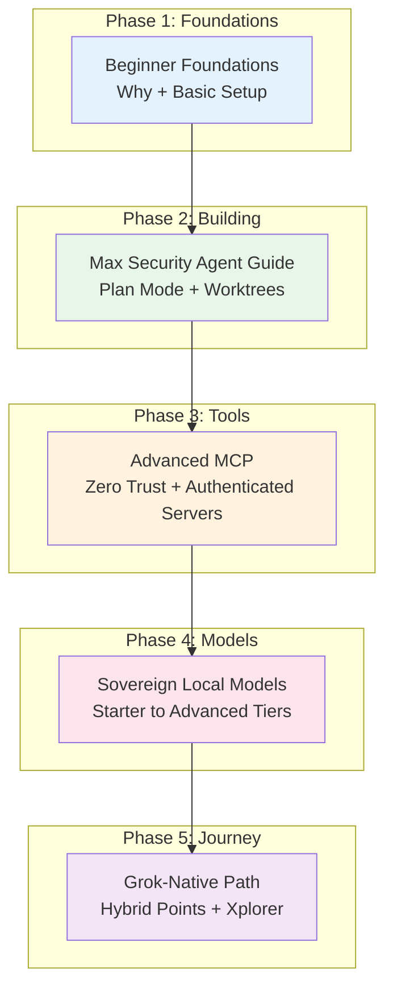

# Sovereign Grok Agent Suite — v1.0.0

# 07 — Sovereign Grok Agent Quick Start Guide

**From Beginner to Sovereign SuperAgent with Grok Build**  
**Version**: v1.0.0

---

## Visual Journey Map



**ASCII Fallback**:
```
Foundations → Building Agents → Harden Tools → Choose Models → Grok-Native Journey + Hybrids
```

---

## v1.1 Tiered Quick-Start Paths

### Entry Tier (Low Hardware / Cost-Conscious / Emerging Markets)
**Goal**: Start fast with minimal hardware and USD spend. Use efficient local models + Grok as a smart lever.

**Path**:
1. Beginner Foundations (focus on low-resource setup)
2. Sovereign Local Models Guide → Entry Tier section
3. Grok-Native Sovereign Agent Path (hybrid basics + using Grok apps/Build strategically)
4. Max Security Agent Guide (light use — focus on Plan Mode + simple worktrees)

**Access Style**: Grok apps for quick reasoning/search + Grok Build for light structured work. Keep most agent logic local.

**Important Note on Grok Build**:
Grok 4.5 is now available on the free tier, making Grok Build much more accessible. However, advanced agentic features (`/goal` and deep context) may upload large parts of your repository (including git history) to Google Cloud Storage. 

**For sensitive work**: Use strict `.gitignore`, worktrees, and prefer local models + self-hosted MCPs.

**July 2026 update**: Grok Build has been fully open-sourced (Apache 2.0) by xAI / SpaceXAI. The source is inspectable and community-auditable.

### Balanced Tier (Recommended for Most Users)
**Goal**: Strong capability with good sovereignty and reasonable hardware.

**Path** (Full recommended order):
1. Beginner Foundations
2. Max Security Agent Guide (core — Plan Mode, worktrees, iteration)
3. Advanced Production MCP (add authenticated tools + Git ops)
4. Sovereign Local Models Guide → Balanced Tier section
5. Grok-Native Sovereign Agent Path (full hybrid patterns)

**Access Style**: Heavy use of Grok Build (connected to your account) for orchestration + selective Grok app use for real-time needs. Strong local models as primary brain. Free community prompt directories can seed specialized local agents (Coordinator + specialists) under Plan Mode and worktrees.

### Top Tier (High Performance / Stronger Hardware or Heavier Grok Use)
**Goal**: Maximum capability while maintaining sovereign guardrails.

**Path**:
1. Beginner Foundations (quick pass)
2. Max Security Agent Guide + Advanced Production MCP (full power)
3. Sovereign Local Models Guide → Top Tier section
4. Grok-Native Sovereign Agent Path (advanced hybrid + multi-agent loops)
5. Experiment with frontier models via Grok subscription where beneficial

**Access Style**: Grok Build as primary orchestration layer + Grok apps/subscription for highest capability tasks. Use local models selectively for sensitive or long-running work.

---

## Key Principles

- Sovereignty first: Prefer local LLM + self-hosted MCPs.
- Leverage Grok subscription as compute/search/reasoning lever.
- Start small, plan first (Plan Mode), iterate in isolation (worktrees).
- Zero Trust on MCPs: Authenticate, scope narrowly, log everything.
- Hybrid when beneficial: Grok for strengths, open models for sovereignty.
- Security is ongoing: Review logs, rotate tokens, keep scope narrow.

---

## Quick Start Steps

1. Install Grok Build + local LLM (Ollama recommended).
2. Create project folder + basic AGENTS.md rules.
3. Learn Plan Mode + worktrees for safe experimentation.
4. Add authenticated self-hosted MCPs for tools.
5. Build your first narrow agent and iterate.

---

## When to Use Which Document

- **New to this?** → Beginner Foundations
- **Ready to build?** → Max Security Agent Guide
- **Need secure tools?** → Advanced Production MCP
- **Choosing models?** → Sovereign Local Models Guide
- **Full Grok journey?** → Grok-Native Sovereign Agent Path

---

**All documents include Mermaid diagrams + ASCII fallbacks.**  
Full suite: https://github.com/MoloBTC-Org/sgas  

**Start here**: Open Beginner Foundations, follow the setup steps, then move to the Max Security Agent Guide.  

License: BSOL v1.0