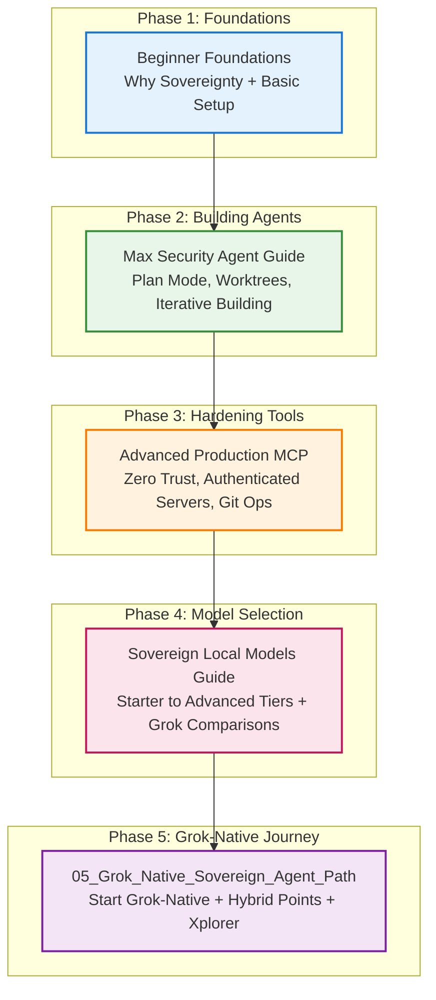

# Sovereign Grok Agent Suite — v1.0.0

# 08 — Visual Journey Map: Sovereign Grok Agent Suite

This map shows the progressive path from beginner to advanced sovereign agent building with Grok Build.



### Text / ASCII Fallback Version of the Journey Map

```
Phase 1: Foundations
   |
   v
Beginner Guide (Why + Basic Setup)
   |
   v
Phase 2: Building Agents
   |
   v
Max Security Agent Guide (Plan Mode + Worktrees)
   |
   v
Phase 3: Hardening Tools
   |
   v
Advanced Production MCP (Zero Trust + Authenticated Servers)
   |
   v
Phase 4: Model Selection
   |
   v
Sovereign Local Models Guide (Starter to Advanced Tiers)
   |
   v
Phase 5: Grok-Native Journey
   |
   v
Grok_Native Path (Start Grok-Native + Hybrid Points + Xplorer)
```

### v1.1 Tiered Reading Paths

**Entry Tier** (Low hardware / cost-conscious / emerging markets):  
Beginner Foundations → Sovereign Local Models (Entry Tier section) → Grok-Native Path (basic hybrid use)

**Balanced Tier** (Recommended for most):  
Beginner Foundations → Max Security Agent Guide → Advanced Production MCP → Sovereign Local Models (Balanced Tier) → Grok-Native Path (full hybrid patterns)

**Top Tier** (High performance / strong hardware or heavier Grok use):  
Full path above + extra focus on Sovereign Local Models (Top Tier) and advanced multi-agent / hybrid techniques in Grok-Native Path

This map now supports different starting points and depths depending on your hardware and goals.

**Canonical path**: `docs/` in https://github.com/MoloBTC-Org/sgas